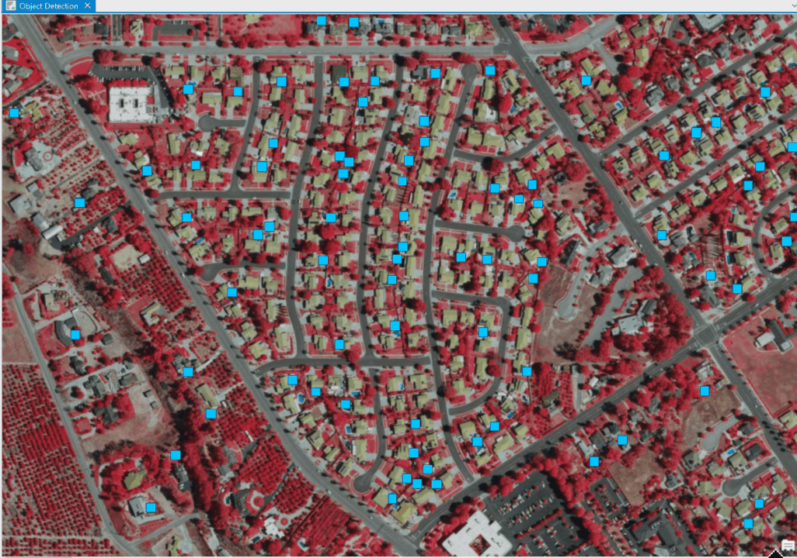

# Swimming Pool Detection Using ArcGIS and Python
A deep learning model using ArcGIS and Python developed to assist local government tax assessors in detecting swimming pools within a specific area. The solution identifies newly constructed or unrecorded pools that influence property valuations. This approach improves the accuracy of property assessments and reduces reliance on manual surveys. The project aims to help assessors adjust property values and taxes more effectively, potentially increasing community revenue. Python was used for data preprocessing, model training, and integration with ArcGIS tools.

